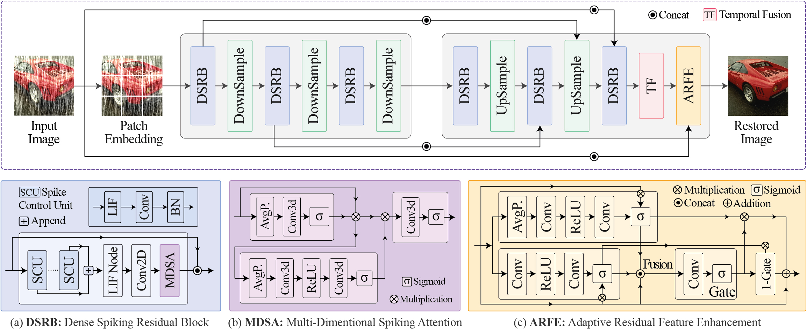

<h4 align="center"><strong><a href="https://wacv.thecvf.com/">Accepted at WACV 2026, Tucson, Arizona, USA</a></strong></h4>
<h2 align="center"><strong>SpikeRain: Towards Energy-Efficient Single Image Deraining with Spiking Neural Networks <a href="https://github.com/tanvirnwu/SpikeRain/blob/a45ca963087d61e2a27dcd9c5610e516cd5e9c14/assets/SpikeRain_WACV_2026_Accepted.pdf" target="_blank">[Paper]</a></strong></h2>
<h6 align="center">Md Tanvir Islam 1, Inzamamul Alam 2, Sambit Bakshi 3, Khan Muhammad 2, *, Javier Del Ser 4, Sangtae Ahn 1, *</h6>
<h6 align="center">| 1. Kyungpook National University, South Korea | 2. Sungkyunkwan University, South Korea | 3. National Institute of Technology, India | 4. University of the Basque Country, Spain || *Corresponding Authors |</h6> 

## SpikeRain Architecture

## Details will be uploaded soon...
