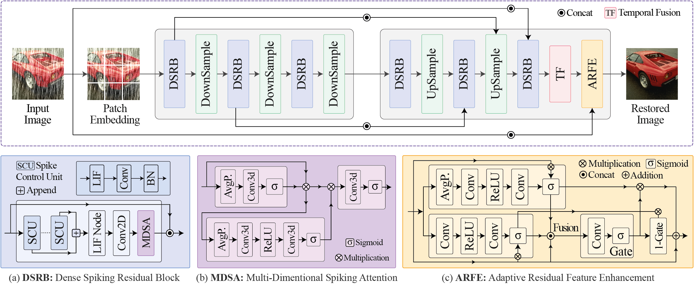

<h4 align="center"><strong><a href="https://wacv.thecvf.com/">Accepted at WACV 2026, Tucson, Arizona, USA</a></strong></h4>
<h2 align="center"><strong>SpikeRain: Towards Energy-Efficient Single Image Deraining with Spiking Neural Networks <a href="https://openaccess.thecvf.com/content/WACV2026/html/Islam_SpikeRain_Towards_Energy-Efficient_Single_Image_Deraining_with_Spiking_Neural_Networks_WACV_2026_paper.html" target="_blank">[Paper]</a></strong></h2>
<h6 align="center">Md Tanvir Islam<sup> 1</sup>, Inzamamul Alam<sup> 2</sup>, Sambit Bakshi<sup> 3</sup>, Khan Muhammad<sup> 2, *</sup>, Javier Del Ser<sup> 4</sup>, Sangtae Ahn<sup> 1, *</sup></h6>
<h6 align="center">| 1. Kyungpook National University, South Korea | 2. Sungkyunkwan University, South Korea | 3. National Institute of Technology, India | 4. University of the Basque Country, Spain || *Corresponding Authors |</h6> 
<hr>


## SpikeRain Architecture



## Repository Structure
```
assets/
  figures/                 # Figures used in the paper/README
  paper/                   # Accepted paper PDF
model/
  modules.py               # Core blocks: DSRB, MDSA, Temporal Fusion, ARFE
  spikerain.py             # SpikeRain model definition and factory
utils/                     # Utility helpers (metrics, model utils, etc.)
dataset_loader.py          # Training dataset loader
train.py                   # Training script
test.py                    # Inference/testing script
evaluation.py              # PSNR/SSIM/LPIPS evaluation
requirements.txt           # Python dependencies
```

## Environment Setup

### Conda
```bash
conda create -n spikerain python=3.8 -y
conda activate spikerain
pip install -r requirements.txt
```

### Pip
```bash
python -m venv .venv
source .venv/bin/activate
pip install -r requirements.txt
```

## Dataset Preparation
The repository expects paired rainy/clean images stored in per-dataset folders. A recommended layout is:
```
data/
  Rain200H/
    train/
      input/
      gt/
    test/
      input/
      gt/
```

**Naming conventions:**
- Input images are the rainy observations in `input/`.
- Ground-truth images are the clean targets in `gt/`.
- Supported image formats include `.png` and `.jpg`.

**Important:** `dataset_loader.py` expects the clean folder to be named `target/` for training and validation. You can either:
- Rename `gt/` → `target/`, or
- Create a symlink `target` pointing to `gt`.

**RW-Data:** This dataset has no ground truth. The provided `evaluation.py` requires paired targets, so for RW-Data use qualitative inspection or external no-reference metrics.

## Training
The training script already exposes arguments via `argparse`. Example:
```bash
python train.py \
  --train_dir ./data/Rain200H/train \
  --val_dir ./data/Rain200H/test \
  --model_save_dir ./checkpoints \
  --version M \
  --T 4
```

Common arguments:
- `--train_dir`: path to training set root (contains `input/` and `target/`).
- `--val_dir`: path to validation/test set root (contains `input/` and `target/`).
- `--model_save_dir`: output checkpoint directory.
- `--version`: model size variant (`S`, `M`, `L`).
- `--T`: number of spiking timesteps.

## Testing / Inference
```bash
python test.py \
  --weights ./checkpoints/SpikeRain_M/models/<session>/model_best.pth \
  --data_path ./data/Rain200H/test/input \
  --save_path ./results/Rain200H
```

Key arguments:
- `--data_path`: directory containing input rainy images.
- `--save_path`: output directory for restored images.
- `--model_version`: model size variant (`S`, `M`, `L`).
- `--T`: number of spiking timesteps.

## Evaluation
```bash
python evaluation.py \
  --generated_images_path ./results/Rain200H \
  --target_path ./data/Rain200H/test/gt
```

`evaluation.py` computes PSNR, SSIM, and LPIPS. For datasets without ground truth (e.g., RW-Data), skip this script or use no-reference metrics.

## Reproducibility
The training script sets random seeds for Python, NumPy, and PyTorch. It also enables `torch.backends.cudnn.benchmark = True`, which favors performance over strict determinism.

## Citation
If you use this code, please cite:
```bibtex
@InProceedings{Islam_2026_WACV,
    author    = {Islam, Md Tanvir and Alam, Inzamamul and Bakshi, Sambit and Muhammad, Khan and Del Ser, Javier and Ahn, Sangtae},
    title     = {SpikeRain: Towards Energy-Efficient Single Image Deraining with Spiking Neural Networks},
    booktitle = {Proceedings of the IEEE/CVF Winter Conference on Applications of Computer Vision (WACV)},
    month     = {March},
    year      = {2026},
    pages     = {1094-1105}
}
```

## License
This project is released under the MIT License. See [LICENSE](LICENSE).
